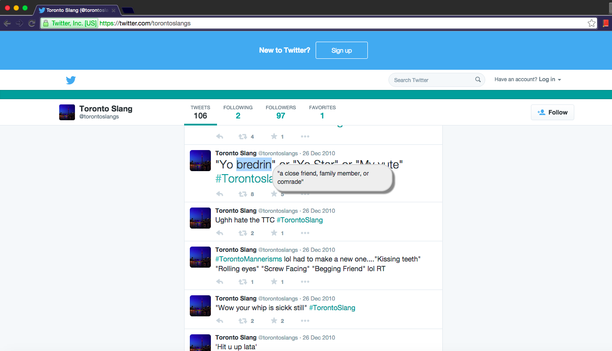

# SlangLang

SlangLang is a Chrome extension that allows easy lookups for the definitions of words (proper English and slang) right in your browser. 

**How to use:**

Use your cursor to highlight the word you wish to lookup. A tooltip containing the definition of the word will pop up right beside it. 

You can toggle the state of the extension by clicking on the dictionary icon in the top-right corner of your Chrome browser and then click on the "Disable" button. 

To report a bug please create a new issue on the right. 